# Assignment #1 — HTML & CSS Basics
# Zhasmira Mamyrbayeva
# SE-2539
# About the Project
This project is my first webpage created using HTML and CSS.  
The purpose of this assignment was to learn the basic structure of HTML,
work with different HTML elements, and use CSS to style and organize a webpage.

# Part 1. Introduction to HTML
## Step 0. Basic HTML Structure
I created an `index.html` file and added the basic HTML structure:
`<!DOCTYPE html>`, `<html>`, `<head>`, `<title>`, and `<body>`.

The title of my webpage is **"My First Webpage"**.
## Screenshot
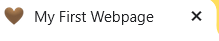

## Step 1. Text Structure
I used `<h1>`, `<h2>`, and `<h3>` headings for the course name,
my name, and different sections of the webpage.
I also created an "About Me" section using a paragraph `
`.
### Screenshot
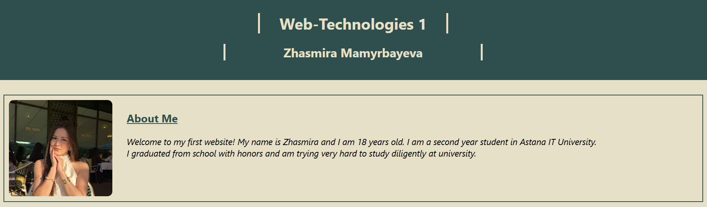

## Step 2. HTML Lists
I created:
- an ordered list `<ol>` for my hobbies
- an unordered list `<ul>` for my favorite websites
### Screenshot
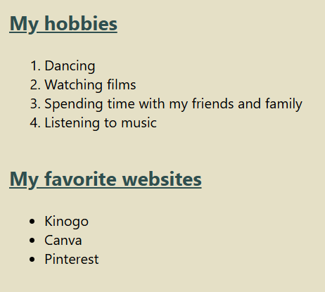

## Step 3. Images and Links
I added my photo using the `` tag.
I also added clickable links to my favorite websites using the `<a>` tag.
### Screenshot
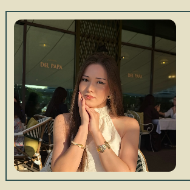

## Step 4. HTML Button
I created a simple **"Click Me"** button using the `<button>` tag.
### Screenshot
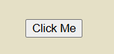

# Part 2. Intermediate HTML
## Step 5. Tables
I created a weekly class schedule using a table.
The table contains three columns:
- Subject
- Day
- Time
### Screenshot
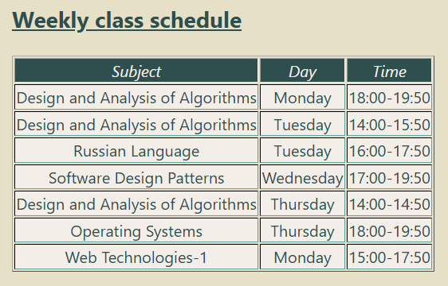

## Step 7. Emojis
I created a paragraph about my mood and added several emojis using HTML emoji codes.
### Screenshot
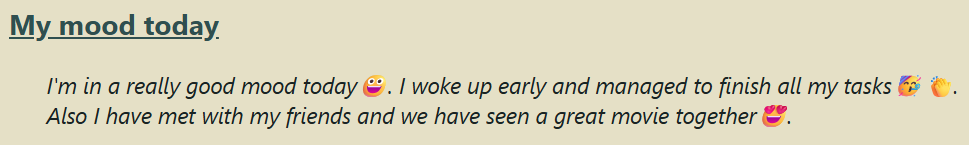

## Step 8. HTML Form
I created a contact form with:
- Name input;
- Email input;
- Favorite Color input;
- Submit button.
### Screenshot
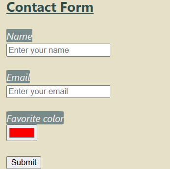

# Part 3. Introduction to CSS
## Step 9. Introduction to CSS
I added CSS styles to improve the appearance of my webpage.
I changed colors, fonts, spacing, backgrounds, and other visual properties.
### Screenshot
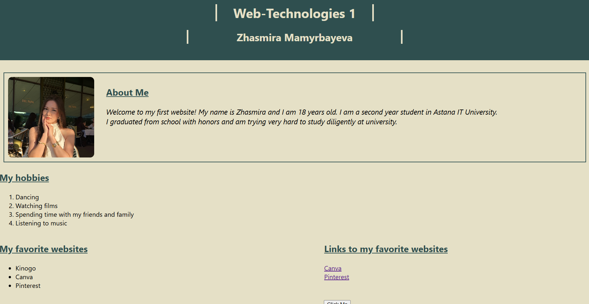

## Step 10. Inline CSS
I used inline CSS to change the color of one paragraph.
### Screenshot
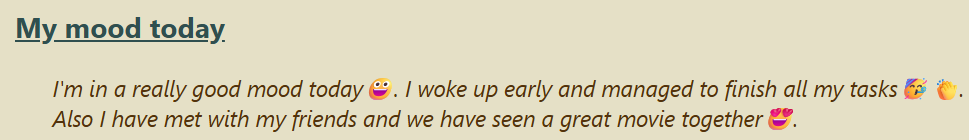

## Step 11. Internal CSS
I added internal CSS inside the `<style>` element in the `<head>`.
I used it to style headings and form labels.
### Screenshot
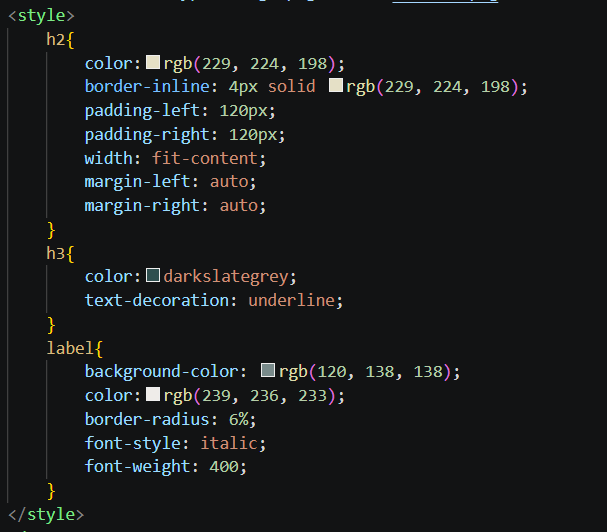

## Step 12. External CSS
I created a separate `style.css` file and connected it to my HTML file using:
`<link rel="stylesheet" href="style.css">`
### Screenshot
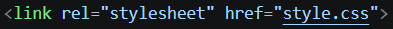

## Step 13. CSS Syntax and Selectors
I used different types of CSS selectors:
- Element selectors, such as `p`, `h2`, and `h3`;
- Class selectors, such as `.about` and `.highlight`;
- ID selectors, such as `#main-heading`, `#header`, and `#footer`.
### Screenshot
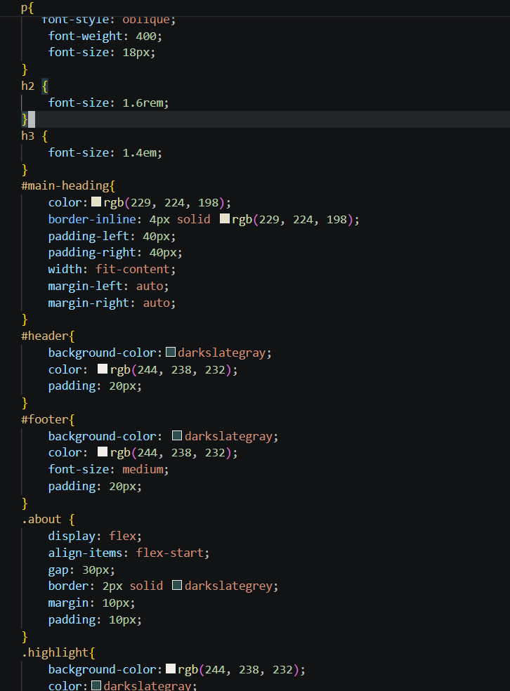

## Step 14. Classes vs IDs
I created the `.highlight` class and applied it to multiple rows of my table.
I also created the `#main-heading` ID to style the main heading.
### Screenshot
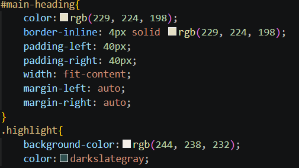

# Part 4. Intermediate CSS
## Step 15. Favicon
I added a favicon to my webpage using:
`<link rel="icon" type="image/png" href="favicon.png">`
### Screenshot
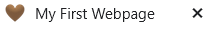

## Step 16. HTML Divs
I divided my webpage into three main sections using `
`:
- Header
- Main content
- Footer
I used different background colors and padding to style these sections.
### Screenshot
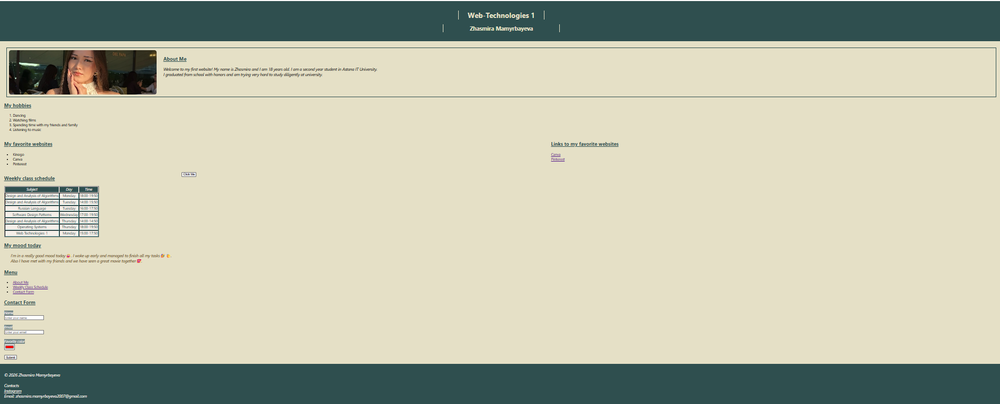

## Step 17. Box Model
I practiced the CSS Box Model by using:
- `margin`;
- `padding`;
- `border`.
For example, I applied these properties to my About Me section.
### Screenshot
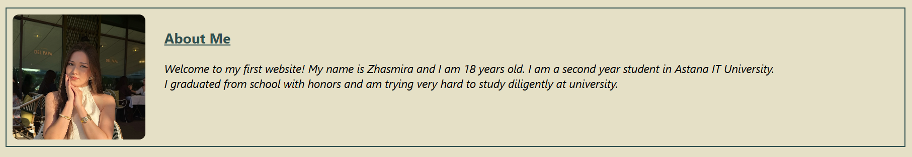

## Step 18. CSS Positioning
I used three different CSS position values:
- `static`;
- `relative`;
- `absolute`.
I used `relative` to slightly move my mood paragraph and `absolute`
to position the "Thank you!" text.
### Screenshot
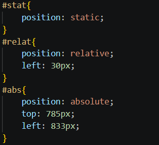

## Step 19. CSS Sizing
I used different CSS sizing units:
- `px`;
- `%`;
- `em`;
- `rem`.
I used them to change the sizes of my image and headings.
### Screenshot
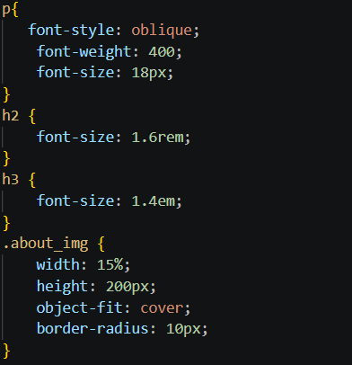

## Step 20. Float and Clear
I created two boxes.
The first box uses `float: left` and the second box uses `float: right`.
I also used `clear: both` so that the next section starts below both floated elements.
### Screenshot
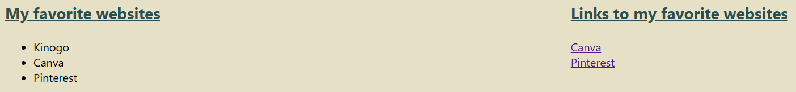

# Summary
During this assignment, I learned how to create and structure a webpage using HTML
and how to style it using CSS. I practiced working with headings, paragraphs, lists, images, links, buttons,
tables, forms, and div elements. I also learned different ways of applying CSS:
inline, internal, and external CSS. In addition, I practiced CSS selectors, the box model, positioning, sizing units,
float, and clear. This assignment helped me understand how HTML defines the structure of a webpage
and how CSS can be used to change its design and layout.